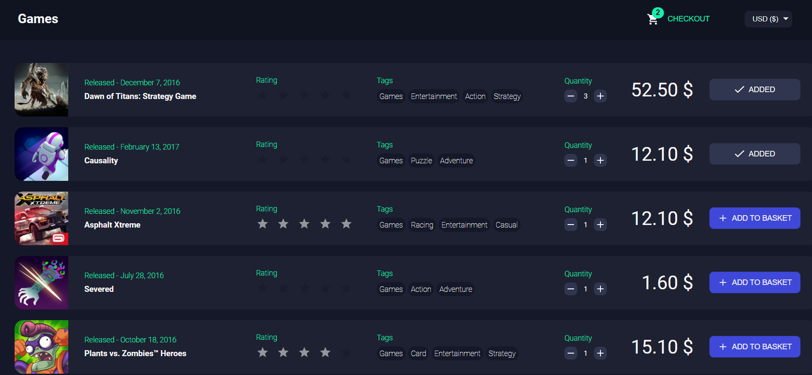
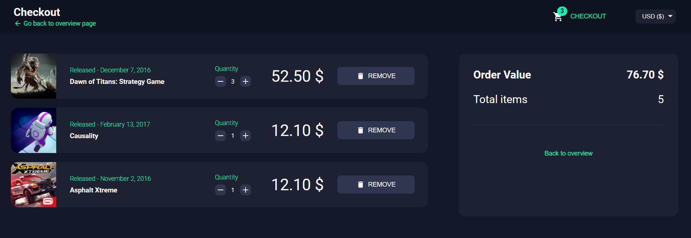

# game_store

## Start and test the app

In the project directory, you can run:

- npm start
- npm test (OR npm test -- --coverage)

## API Mock

This project includes a [miragejs](https://miragejs.com/) api mock that starts with the project.

The API mock provides a set of endpoints to retrieve the games and currency rate data.

## Views

- Store View:

 

  

- Checkout View:

 

  

